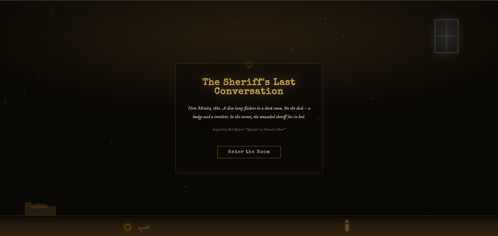
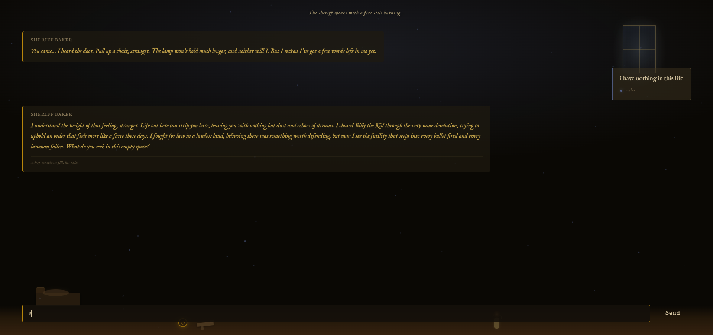
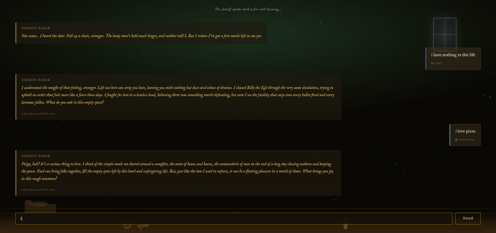
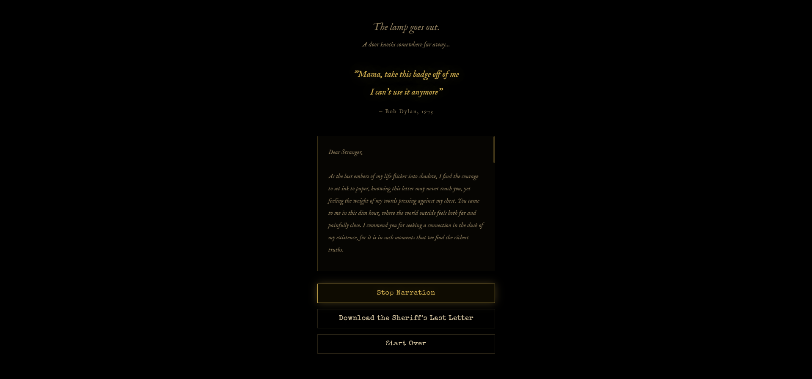

# The Sheriff's Last Conversation

**"Mama, take this badge off of me / I can't use it anymore"**
*— Bob Dylan, Knockin' on Heaven's Door (1973)*

---

## Artistic Statement

This project brings to life the dying sheriff from Sam Peckinpah's *Pat Garrett & Billy the Kid* (1973) — the character for whom Bob Dylan wrote "Knockin' on Heaven's Door." Through an interactive AI chatbot, the user sits at the bedside of Sheriff Colin Baker in his final moments. As the conversation unfolds, the sheriff's words grow shorter — a metaphor for approaching death. In his last message, he whispers only *"Knock..."* and the screen fades to black.

This is not a chatbot. It is a farewell.

---

## Technical Architecture

```
┌─────────────────────────────────────────────────┐
│              FRONTEND (HTML / CSS / JS)          │
│                                                  │
│  • Dark room UI with CSS art (lamp, desk, bed)   │
│  • Particle system (canvas-based dust motes)     │
│  • Sentiment-reactive visuals                    │
│  • 3-stage visual progression (light dims)       │
│  • Typewriter effect for sheriff's responses     │
│  • AI-generated farewell letter export (.txt)    │
└────────────────────┬────────────────────────────┘
                     │ REST API
┌────────────────────▼────────────────────────────┐
│              BACKEND (Python FastAPI)             │
│                                                  │
│  ┌──────────┐  ┌──────────┐  ┌───────────────┐  │
│  │   RAG    │  │   LLM    │  │  Sentiment    │  │
│  │ Pipeline │──│ GPT-4o   │──│  Analysis     │  │
│  │LangChain │  │  -mini   │  │  (TextBlob)   │  │
│  │+ChromaDB │  │          │  │               │  │
│  └──────────┘  └──────────┘  └───────────────┘  │
│       │              │              │            │
│       │   Conversation Manager      │            │
│       │   (Session, Stage, Memory)  │            │
│       └──────────────┴──────────────┘            │
└──────────────────────────────────────────────────┘
```

### Data Flow

```
User Message
    │
    ├─► Sentiment Analysis (TextBlob NLP)
    │       → polarity → emotion label → tone cue for LLM
    │       → visual cue for frontend (particle color, lamp glow)
    │
    ├─► RAG Retrieval (LangChain + ChromaDB)
    │       → similarity search across 170 embedded chunks
    │       → returns top-k historical context passages
    │
    └─► LLM Generation (GPT-4o-mini)
            → system prompt (stage-based character instructions)
            → conversation history (session memory)
            → RAG context (historical depth)
            → sentiment tone cue (emotional adaptation)
            → token limit decreases per stage (250 → 80 → 60 → 10)
            → sheriff's response
```

---

## Conversation Stages

| Stage | Messages | Sheriff's Tone | Max Tokens | Visual |
|-------|----------|----------------|------------|--------|
| 1 - Defiance | 1-4 | Strong, narrative, 3-5 sentences | 250 | Full lamplight |
| 2 - Acceptance | 5-8 | Reflective, 2-3 sentences | 80 | Lamp dims, darkness grows |
| 3 - Farewell | 9 | Whisper, 1-2 sentences | 60 | Near darkness |
| 4 - Final Breath | 10 | "Knock..." | 10 | Black screen, knock sound |

---

## AI Techniques Used

This project integrates **three distinct AI techniques** that work interdependently:

### 1. RAG Pipeline (Retrieval-Augmented Generation)
- **Framework:** LangChain
- **Vector DB:** ChromaDB (local, persistent)
- **Embedding Model:** OpenAI `text-embedding-ada-002`
- **Corpus:** 14 source documents (49 pages) → 170 embedded chunks
- **Sources include:** Dylan interviews, Vietnam War chronology, Pat Garrett screenplay, Kerry's Senate speech, Savio's Berkeley manifesto, 1973 America context
- **Role:** Provides historically grounded context so the sheriff's words carry the weight of the era

### 2. LLM (Large Language Model)
- **Model:** OpenAI GPT-4o-mini
- **Role:** Generates in-character dialogue as Sheriff Colin Baker
- **Stage system:** 4-stage prompt engineering controls the dramatic arc:
  - Stage 1 (Defiance): 3-5 sentences, strong and narrative
  - Stage 2 (Acceptance): 2-3 sentences, reflective and regretful
  - Stage 3 (Farewell): 1-2 sentences, almost a whisper
  - Stage 4 (Final Breath): outputs only "Knock..."
- **Token limits** decrease per stage (250 → 80 → 60 → 10) to enforce brevity
- **Also used for:** generating personalized farewell letters after conversation ends

### 3. Sentiment Analysis (NLP)
- **Library:** TextBlob with custom keyword override layer
- **Role:** Analyzes the emotional tone of each user message before it reaches the LLM
- **Pipeline:** `User Message → TextBlob polarity → keyword overrides → emotion label → tone cue`
- **5 emotion categories:** anguished, somber, calm, warm, compassionate
- **Keyword overrides:** Custom regex patterns catch crisis language (suicidal ideation, despair, nihilism) that TextBlob's polarity averaging misses
- **Dual output:**
  - **To LLM:** injects a tone cue into the system prompt so the sheriff adapts his response
  - **To Frontend:** drives visual changes (particle color, lamp glow color, message border, sentiment badge)

### How They Interact

The three techniques form a **closed loop**: Sentiment Analysis detects the user's emotional state and modifies both the LLM's behavior (tone cue injection) and the frontend visuals. RAG provides the LLM with period-accurate historical context. The LLM synthesizes all inputs — stage instructions, sentiment cues, RAG context, and conversation history — into a single in-character response. None of the three techniques could produce the experience alone.

---

## Installation and Setup

### Prerequisites
- Python 3.10+
- An OpenAI API key ([platform.openai.com](https://platform.openai.com))

### Steps

```bash
# 1. Clone the repository
git clone https://github.com/nalanng/the-sheriffs-last-conversation.git
cd the-sheriffs-last-conversation

# 2. Create and activate virtual environment
python -m venv venv
source venv/bin/activate        # macOS/Linux
venv\Scripts\activate           # Windows

# 3. Install dependencies
pip install -r requirements.txt

# 4. Download TextBlob corpora (required for sentiment analysis)
python -m textblob.download_corpora

# 5. Set up your API key
cp .env.example .env
# Edit .env and add your OpenAI API key

# 6. Build the vector database (only needed once)
python -m backend.rag.vectorstore

# 7. Run the application
uvicorn backend.main:app --reload --port 8000
```

Open your browser and navigate to **http://localhost:8000**

> **Note:** The ChromaDB vector store is pre-built and included in the repository under `data/processed/`. Step 6 is only needed if you want to rebuild it from the raw sources.

---

## Dependencies

| Package | Version | Purpose |
|---------|---------|---------|
| FastAPI | 0.115.0 | Web framework and API |
| Uvicorn | 0.30.6 | ASGI server |
| OpenAI | 1.51.0 | GPT-4o-mini API client |
| LangChain | 0.3.1 | RAG pipeline orchestration |
| LangChain-OpenAI | 0.2.1 | OpenAI embeddings integration |
| LangChain-Community | 0.3.1 | ChromaDB vector store integration |
| ChromaDB | 0.5.7 | Local vector database |
| PyPDF | 4.3.1 | PDF document loading |
| TextBlob | 0.20.0 | NLP sentiment analysis |
| python-dotenv | 1.0.1 | Environment variable management |
| Pydantic | 2.9.2 | Request/response validation |

### API Requirements
- **OpenAI API Key** — used for both GPT-4o-mini (chat) and text-embedding-ada-002 (embeddings)

---

## Project Structure

```
the-sheriffs-last-conversation/
├── backend/
│   ├── main.py                 # FastAPI app + endpoints
│   ├── llm/
│   │   ├── client.py           # GPT-4o-mini API calls + farewell letter
│   │   ├── conversation.py     # Session manager, stage transitions
│   │   ├── sheriff_prompt.py   # 3-stage character system prompt
│   │   └── sentiment.py        # TextBlob NLP + keyword overrides
│   └── rag/
│       ├── loader.py           # PDF/TXT document loading
│       ├── vectorstore.py      # ChromaDB embedding + persistence
│       └── retriever.py        # Similarity search retrieval
├── frontend/
│   ├── index.html              # Intro → Chat → End screens
│   ├── styles/                 # Modular CSS (dark room, sentiment, stages)
│   ├── scripts/                # Modular JS (chat, particles, audio, API)
│   └── assets/                 # Static assets
├── data/
│   ├── raw/                    # 14 source documents (Dylan, Vietnam, film)
│   └── processed/              # ChromaDB vector store (170 chunks)
├── requirements.txt
├── .env.example
```

---

## RAG Source Documents

| Category | Files | Content |
|----------|-------|---------|
| **Dylan** | 5 files | Playboy interview (1966), Nobel lecture (2016), song lyrics, cover history, 1997 film |
| **Film & Screenplay** | 4 files | Pat Garrett & Billy the Kid screenplay, Cineaste analysis, academic analyses |
| **Historical Context** | 4 files | Vietnam War overview, Kerry Senate speech (1971), Savio Berkeley manifesto (1964), 1973 America context |
| **References** | 1 file | 13 academic references |

---

## Frontend Features

- **CSS Art Room Scene** — desk with badge & revolver, bed with sheriff silhouette, moonlit window (no images, pure CSS)
- **Canvas Particle System** — dust motes that react to sentiment (color changes)
- **Typewriter Effect** — sheriff's words appear letter by letter, speed varies by stage
- **Stage Transitions** — lamp dimming, darkness overlay, narrator text between stages
- **Voice Narration** — Web Speech API reads the farewell letter aloud in a deep, slow tone
- **Farewell Letter** — AI-generated personalized letter, downloadable as .txt
- **Knock Sound** — Web Audio API synthesized three-knock sound (no audio files needed)

---

## Example Experience

**Stage 1 — Defiance:** The sheriff speaks with strength, tells stories of chasing Billy the Kid, defends his badge and his choices. He asks you questions.

**Stage 2 — Acceptance:** The fight leaves him. He speaks of regrets, draws parallels to Vietnam, doubts whether the badge was worth carrying. His responses shorten.

**Stage 3 — Farewell:** Only whispered fragments remain. No questions, no advice — just a few broken final words.

**Final message:** *"Knock..."* — the screen fades to black, a knocking sound plays.

**After the conversation:** The user can listen to or download "The Sheriff's Last Letter to You" — a personalized farewell letter generated by GPT-4o-mini, written in the Sheriff's voice, referencing specific topics from their conversation.

---

## Screenshots

| Screen | Description |
|--------|-------------|
|  | Opening screen with door frame and "Enter the Room" button |
|  | Stage 1 conversation with **somber** sentiment detection |
|  | Multiple sentiment labels: **somber** and **compassionate** |
|  | End screen with farewell letter and voice narration |

---

## AI Tools Used

- **OpenAI GPT-4o-mini** — LLM for character dialogue and farewell letter generation
- **OpenAI text-embedding-ada-002** — Document embedding for RAG pipeline
- **LangChain** — RAG pipeline orchestration (loading, chunking, retrieval)
- **ChromaDB** — Local vector database for semantic search
- **TextBlob** — NLP-based sentiment analysis (3rd AI technique)
- **Web Speech API** — Browser-native text-to-speech for letter narration

---

## API Endpoints

| Method | Endpoint | Description |
|--------|----------|-------------|
| POST | `/start` | Create a new conversation session |
| POST | `/chat` | Send a message to the sheriff |
| POST | `/reset` | Reset and create a new session |
| GET | `/export/{session_id}` | Export conversation history |
| GET | `/export/{session_id}/letter` | Generate farewell letter |
| GET | `/health` | Health check |

---

*CSE 5058 Introduction to Artificial Intelligence — Creative Project*
*Inspired by Bob Dylan's "Knockin' on Heaven's Door" (1973)*
